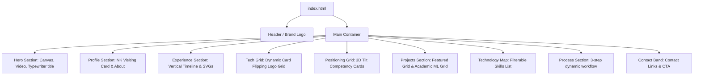

# Nithees Kanna Portfolio — Design & Architecture System

This document outlines the UI/UX design tokens, layout hierarchy, custom components, and interactive frontend mechanics for Nithees Kanna's (NK) personal portfolio webpage. The webpage is designed to look **modern, minimalistic, and performance-tuned**, featuring dark/light modes, smooth animations, and developer-centric aesthetic details.

---

## 1. Design System & Style Tokens

The portfolio operates on a responsive, dual-theme design system. Style values are mapped to CSS variables to ensure consistency, theme awareness, and clean, modular stylesheet management.

### 1.1 Color Palette
The color variables balance a clean off-white canvas in Light Mode with an ink-green dark mode inspired by high-end development environments and night terminals.

| CSS Variable | Light Theme | Dark Theme | Purpose / Usage |
| :--- | :--- | :--- | :--- |
| `--bg` | `#f5f7f8` | `#111412` | Main page background |
| `--surface` | `#ffffff` | `#191d1a` | Card surfaces, container backgrounds |
| `--ink` | `#151515` | `#f4f7f2` | Primary typography & headers |
| `--muted` | `#63706b` | `#b0b9b2` | Subheadings, secondary/body copy |
| `--line` | `rgba(21, 21, 21, 0.12)` | `rgba(244, 247, 242, 0.14)` | Borders, dividers, subtle grids |
| `--accent` | `#166a4f` | `#67c69c` | Primary brand green (Forest / Mint) |
| `--accent-2` | `#d45732` | `#ee815f` | Secondary brand warm color (Terracotta / Coral) |
| `--accent-3` | `#f1b84b` | `#f3c96c` | Tertiary highlights (Gold / Amber) |
| `--shadow` | `0 24px 70px rgba(18, 31, 27, 0.12)` | `0 24px 70px rgba(0, 0, 0, 0.36)` | Elevated components & cards |

### 1.2 Typography
Typography is layered using modern geometric, grotesque, and humanist typefaces to give a crisp tech-oriented look:
*   **Branding & Display Headings:** `'Coolvetica', sans-serif` – Custom sans-serif face providing a bold, retro-modern, geometric layout structure.
*   **Body Text & General Copy:** `'Inter', sans-serif` – Clean, highly readable humanist sans-serif with excellent legibility at variable weights (`300` to `700`).
*   **Special Accents & UI Details:** `'Space Grotesk', sans-serif` – A quirky, geometric typeface used in custom tags, UI details, and headers.
*   **Code Elements:** `'JetBrains Mono', monospace` – Used as a fallback and coding symbol typography.

---

## 2. Layout Structure

The layout is structured as a single-page app utilizing CSS Grid and Flexbox for modularity.



### 2.1 Hero Section
*   **Performance Canvas:** Uses a canvas drawing context (`#videoCanvas`) coupled with a hidden video element (`.hero-video`) to render smooth visual assets with low processing overhead.
*   **Orbs & Glows:** Three floating blur containers (`.orb-1`, `.orb-2`, `.orb-3`) provide a glassmorphic background layout.
*   **Typewriter Title:** Types out `Hello World!` with a custom typewriter animation using JavaScript interval loops.

### 2.2 Profile Visiting Card
*   A "visiting card" (`.visiting-card`) featuring NK's dual-persona badge: 
    *   *Default text:* "I am NK / I am your friendly neighbourhood..."
    *   *Batman Easter Egg:* A strike-through transition triggers the text "NAAH I AM VENGEANCE" accompanied by a white bat symbol (`white_bat_symbol.png`).

### 2.3 Interactive Vertical Timeline
*   Alternating layout: Left-aligned and right-aligned nodes (`.timeline-node.is-left` vs. `.timeline-node.is-right`).
*   **SVG Tracker:** An inline SVG path element (`.timeline-svg`) connects the nodes. As the page scrolls, the path's stroke is filled dynamically based on scroll distance.

---

## 3. Custom Interactive Elements & Scripts

Dynamic interactions enhance the minimalistic vibe with subtle micro-animations.

### 3.1 Cursor Glow Tracker
A light container (`.cursor-glow`) follows the user's cursor across the screen. It is powered by a `pointermove` event listener in JavaScript:
```javascript
window.addEventListener("pointermove", (event) => {
  glow.style.transform = `translate(${event.clientX}px, ${event.clientY}px) translate(-50%, -50%)`;
});
```

### 3.2 3D Card Tilt (Parallax)
Cards labeled with the `data-tilt` attribute dynamically listen to pointer events, applying an interactive 3D rotation relative to the cursor's coordinate offset from the card's center:
```javascript
tiltCards.forEach((card) => {
  card.addEventListener("pointermove", (event) => {
    const rect = card.getBoundingClientRect();
    const x = event.clientX - rect.left;
    const y = event.clientY - rect.top;
    const rotateX = ((y / rect.height) - 0.5) * -7; // range limit -3.5deg to 3.5deg
    const rotateY = ((x / rect.width) - 0.5) * 7;
    card.style.transform = `rotateX(${rotateX}deg) rotateY(${rotateY}deg) translateY(-3px)`;
  });
  card.addEventListener("pointerleave", () => {
    card.style.transform = ""; // Reset tilt orientation
  });
});
```

### 3.3 Dynamic Tech Stack Slot Swap
Instead of a static list of logos, the website features a **6-slot grid** (`.tech-slot`). Every few seconds:
1.  An active slot is chosen at random.
2.  The card within the slot flips/rotates out (`.tech-card-inner` transition).
3.  The card's graphic content (SVG logo) is swapped from an inactive pool of technical logos (TensorFlow, OpenAI, FastAPI, PyTorch, Docker, etc.).
4.  The card flips back in to display the new logo, showing off a broad stack in a minimal space.

### 3.4 Filterable Technology Map
*   **Filters:** Categories (All, AI, Data, Ops) let users filter technical capabilities.
*   **Feedback:** Rather than hiding elements completely (which shifts layout grids), non-matching skills receive an `.is-muted` opacity modifier, focusing the user's gaze while keeping the layout solid.

---

## 4. Key Components: Projects Grid

The project display is split into two major containers under `#projects`:

### 4.1 Flagship Card: Project Lovelace
Designed to command primary visual attention as a full-width featured card (`.highlighted-project`):
*   **Desktop Layout:** Spans 3 columns (`grid-column: span 3`) with a two-column body layout (Left: Description/Tags, Right: Core Outcomes).
*   **Logo:** SVG icon of an atomic orbit structure with theme-compliant brand styling.
*   **Pulse Badge:** Status badge `[BIGGEST PROJECT]` with keyframe pulse animation.
*   **Border Glow:** Double-stroke custom gradient border highlighting Lovelace as the flagship AI system.

### 4.2 Standard Project Cards
*   Numbered items (e.g. `02`, `03` through `10`) featuring brief descriptions, outcomes bullet lists, and horizontal flex tag pill containers (`.project-tags`).
*   Subtle tilt animations on mouse hover.

---

## 5. Responsive Configuration & Performance

*   **Grid Collapse:** Multi-column grids default to a single-column block at viewport widths `≤ 860px`.
*   **Motion Reduction:** Respects OS preferences (`@media (prefers-reduced-motion: reduce)`) by disabling animations like the logo-bounce and card flips.
*   **Theme Storage:** Toggling the mode updates `localStorage`, keeping user preferences intact across sessions.
